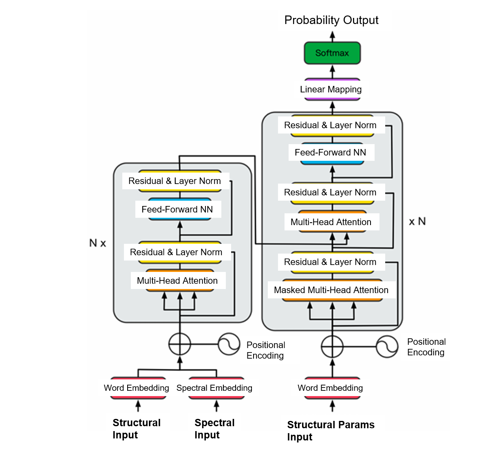
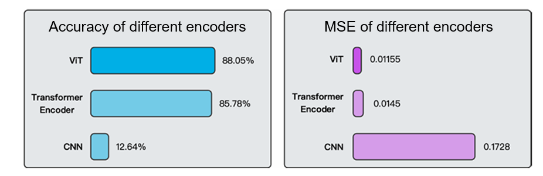
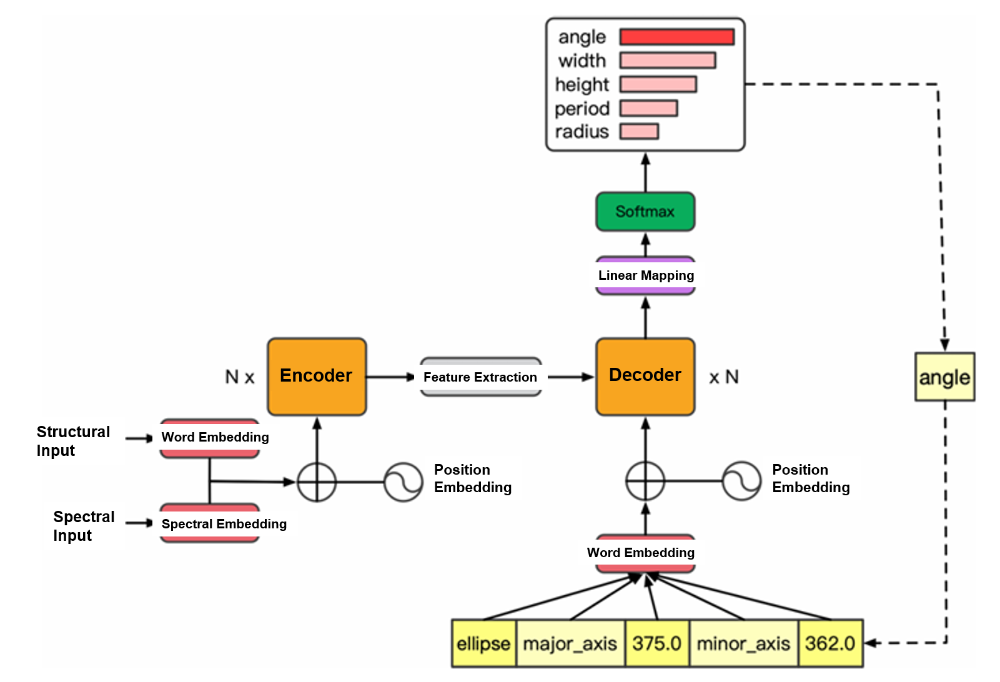
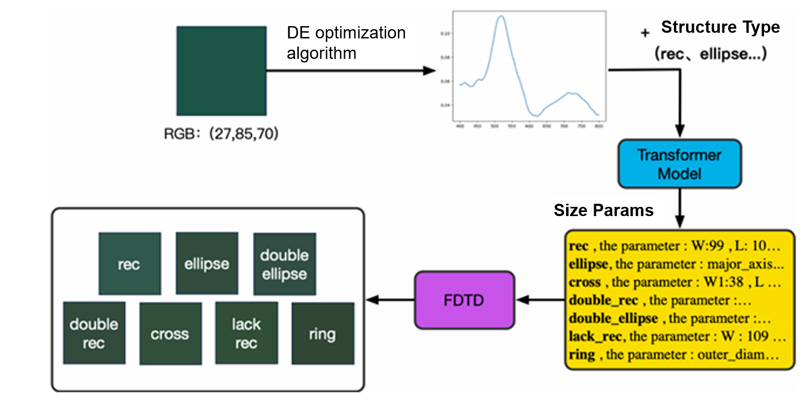
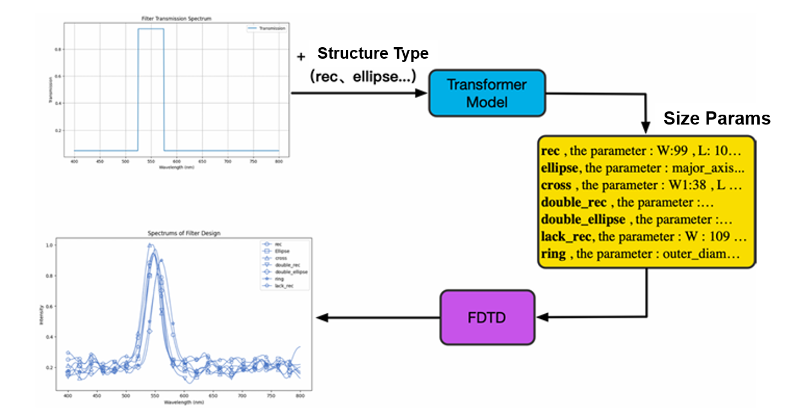

# TransMetaDesign: Transformer-based Metasurface Design

## Introduction

This project is a collaboration with Jilong Yi, a talented graduate student.

TransMetaDesign presents a Transformer-based inverse design framework tailored for nanophotonic applications, enabling the autoregressive generation of structural parameters from target optical properties. Departing from our previous ["MetasurfaceVIT" project](https://github.com/JYJiahaoYan/MetasurfaceVIT), which utilized a Vision Transformer and focused on physics-theory-driven optical data representation, this work employs a comprehensive Encoder-Decoder Transformer architecture. While the prior project emphasized representing optical data aligned with underlying physics, this framework investigates and optimizes various numerical encoding strategies—such as decimal point splitting and exponential encoding—to ensure high precision and computational efficiency, thereby refining the "common way of tokenization" for numerical data in this domain. 

## File Descriptions

- **app.py**: Entry point or main application script for the project. Wrap as RESTful API for future AI agent tool calling.
- **config.py**: Contains configuration classes and logic for loading and managing model, data, and training settings.  Configuration classes in config.py load settings from JSON files in the config folder. 
- **dataloader.py**: Implements the PyTorch Lightning data module and data loading utilities.
- **dataset.py**: Defines dataset classes for handling and accessing structured data.
- **inference.py**: Provides inference routines for running predictions with trained models.
- **loss_func.py**: Contains custom loss function definitions used during model training.
- **model_evalue_plot.py**: Includes visualization and plotting utilities for model evaluation results.
- **model_evalue.py**: Script for evaluating trained models, likely in batch or automated mode.
- **model_predict.py**: Implements prediction and evaluation logic for the inverse model.
- **model.py**: Defines the neural network model architectures used in the project.
- **optical_model.py**: Wraps the model and training logic, possibly as a PyTorch Lightning module.
- **results_presentation.ipynb**: Jupyter notebook for presenting and visualizing model results.
- **scaler.py**: Contains data scaling and normalization utilities.
- **tokenlizer.py**: Implements tokenization logic for converting parameters or sequences to tokens.
- **train_finetune.py**: Script for pretraining on augmented data and fine-tuning on real data.
- **train.py**: Main training script using both real and augmented datasets.
- **utils.py**: Utility functions for data processing, file management, and other helper tasks.
- **/config**: Contains JSON configuration files for data, model, and training settings.
- **/data**: Directory for datasets, data generation scripts, and data documentation.

### Logic of Data Preparation
- **Files:** dataloader.py, dataset.py, scaler.py, tokenlizer.py
- **Classes:**  
  - `MyDataModule` (dataloader.py): PyTorch Lightning DataModule for loading data.  
  - `MyDataset` (dataset.py): Custom dataset class for structured data.  
  - `Scaler` (scaler.py): Handles data normalization.  
  - `Tokenlizer` (tokenlizer.py): Converts parameters to tokens if needed.
- **How it works:**  
  Data is loaded and preprocessed using `MyDataModule` and `MyDataset`, with normalization by `Scaler` and optional tokenization by `Tokenlizer`.

## Visualizations

**Model Structure**

We convert various task objectives (e.g., structural color design, filter design, BIC structure design) into corresponding spectral data, combine it with generated structural information, and feed these as inputs to the Transformer model. Leveraging the Transformer's autoregressive generation capability, the model outputs required structural parameters step-by-step, with each prediction based on the previous output, forming a continuous, refined generation process.

Our model architecture, as shown in the figure, mainly consists of an Encoder and a Decoder. The Encoder first receives spectral data and required structural parameters. For spectral input, a dedicated embedding layer maps it to a high-dimensional feature space; for structural parameters, a word embedding-like method converts them into vector representations. These two processed embedding vectors are concatenated, with positional encoding added to retain sequence position information, and finally input to the Encoder module. The Encoder uses self-attention to extract key features from the spectrum and deeply fuse them with structural information, forming a comprehensive feature representation containing rich optical properties and design intentions.

The Decoder takes initial structural parameter information, which, after word embedding and positional encoding, is fed into the Decoder. Utilizing the Transformer's autoregressive nature, the Decoder gradually leverages previously generated parameters and global features from the Encoder during generation, continuously refining structural parameter predictions via self-attention. Finally, through a series of linear mappings and a softmax layer, the model outputs a probability distribution, from which optimal parameters are selected to complete the entire structural parameter generation process.

Figure 1. Typical transformer structure.

Figure 2. Performances of different encoders.

Figure 3. Schematic showing how decoder and self-regression work.

**How to tokenize physical quantities?**

We tested three strategies: First, split the decimal point into an independent token, encoding the integer part, decimal point, and fractional part separately. Second, convert values into scientific notation using an exponential form. Third, apply Byte Pair Encoding (BPE) for tokenization: BPE works by counting the most frequent symbol pairs (e.g., consecutive digits or digit-symbol combinations) in training data, merging them into new tokens, and recursively building a vocabulary of common subwords or sub-symbols.

Take the number 4.018 as an example: With the first strategy, it is encoded into Token of <4>, Token of <.>, Token of <18>. With the second, it becomes Token of <401>, Token of <E-2>—since the base precision is three digits, 4018 is rounded to 401. With BPE, the input sequence is first split into minimal units (usually single characters); then the most frequent adjacent symbol pairs in the dataset are merged into new tokens, repeating until the preset vocabulary size is reached. This yields Token of <4>, Token of <.0>, Token of <18>.

Comprehensive comparison shows the first strategy—splitting the decimal point into an independent token—performs best in maintaining numerical continuity, controlling vocabulary size, and improving computational efficiency.

Table: Comparison of Effects of Different Numerical Encoding Methods

| Encoding Method               | Character Accuracy | Mean Squared Error | Vocabulary Size | Representation Precision |
|--------------------------------|--------------------|--------------------|-----------------|--------------------------|
| Including All Digits           | 75.37%             | 0.02118            | 59              | Unlimited Precision      |
| Splitting All Digits           | 80.74%             | 0.01949            | 20048           | Two Decimal Places       |
| Encoding Method of Decimal Point Splitting | 88.05%             | 0.01155            | 1049            | Three Decimal Places     |
| Exponential Encoding Method    | 82.65%             | 0.01908            | 2059            | Five-Digit Mantissa      |
| BPE Encoding Method            | 71.24%             | 0.2086             | 3000            | Unlimited Precision      |

**Use Case1: broadband prediction**

In our application workflow, we first define a target structural color, then use a differential mutation algorithm to calculate the corresponding spectral data. In this process, the algorithm is employed to find the spectral response that generates the target color. Next, we input the obtained spectral data together with a predefined structure name into the pre-trained inverse design model. Leveraging its powerful generative capability, the model outputs parameter configurations for different structures. Subsequently, actual RGB values are extracted based on the optical response of the predicted structures. Finally, by comparing the predicted color with the actual color, we find they are highly consistent in color rendering.

**Use Case2: narrowband prediction**

Filters have extensive application value in optics: they can not only precisely filter signals in specific wavelength bands but also play a key role in photonic communication, optical sensing, and display technologies. To verify the effectiveness of our model in filter design, we constructed a target spectrum: it shows a distinct peak at 550nm with a peak height of 0.95 and a peak width of 100nm, while the reflection value is only 0.05 outside the 500–600nm band, aiming to filter out the main peak information in the 500–600nm range. In the specific workflow, we first constructed this ideal spectrum according to the target filter requirements, then input this spectrum along with a preset structure name into the trained inverse design model. The model, relying on its strong generative ability, outputs structural parameters matching the target spectrum. These parameters are then input into a full-wave electromagnetic simulation software (FDTD) for simulation, and the spectral response is extracted from the simulation results. The results show that the simulated spectrum is highly consistent with the expected target spectrum, as shown in the figure, verifying the model’s high precision and reliability in filter design.

